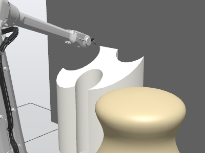
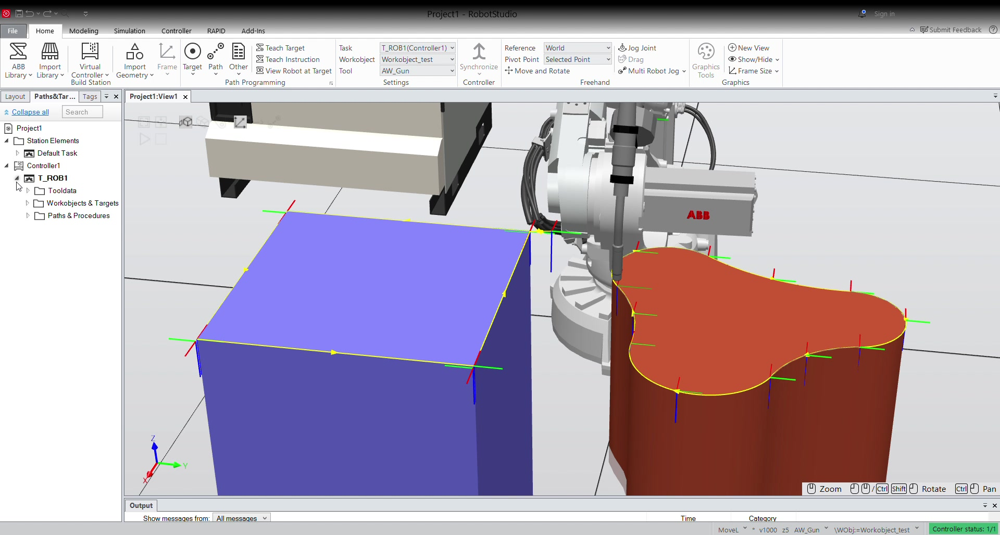
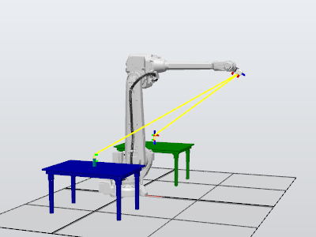
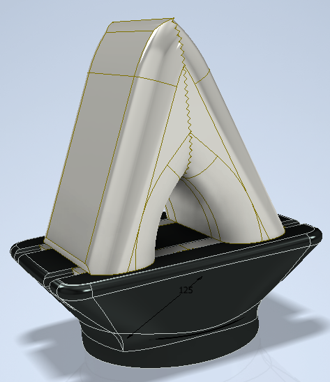

# RobotStudio Automation Projects

Two individual educational automation simulations developed in ABB RobotStudio during engineering studies at Poznan University of Technology.

The repository presents the original station files together with a concise explanation of each automation task. These projects were validated in simulation; they were not physical robot-cell deployments.

With the exception of the standard ABB robot model, I designed and created all 3D elements used in the stations, including the workpieces, tables, custom tool and gripper components.

## Projects

### 1. Contour Following with a Custom Tool

An ABB industrial robot follows programmed contours on three objects with a custom tool. The task focuses on defining a tool, work object and a sequence of robot targets for a repeatable trajectory.

The animation above is a short loop from the simulation. ▶ [Watch the full RobotStudio contour-following recording](assets/contour-following-simulation.mp4)

**Included source**

- [`contour-following.rspag`](contour-following/station/contour-following.rspag) — ABB RobotStudio Pack & Go archive, including the station and RAPID program.
- [`contour-following-preview.gif`](assets/contour-following-preview.gif) — short animated preview shown directly in this README.
- [`contour-following-simulation.mp4`](assets/contour-following-simulation.mp4) — recorded RobotStudio simulation of the programmed contour-following trajectory.
- [Detailed project README](contour-following/README.md)

### 2. Sensor-Based Pick and Place

An ABB robot operates between two tables with a custom gripper. A virtual sensor identifies the table containing the block. The robot approaches the detected block with open jaws, closes the gripper, attaches the part in the simulation, transfers it to the opposite table and releases it. If the first table is empty, the control logic checks the other table and performs the reverse transfer.

The station uses RobotStudio simulation components for sensor detection, attachment and detachment.

**Included source**

- [`sensor-based-pick-and-place.rsstn`](sensor-based-pick-and-place/station/sensor-based-pick-and-place.rsstn) — ABB RobotStudio station.
- [`robot-gripper-jaws.ipt`](sensor-based-pick-and-place/cad/robot-gripper-jaws.ipt) — Autodesk Inventor source model for the gripper jaws.
- [Detailed project README](sensor-based-pick-and-place/README.md)

## 3D Station Design

Except for the ABB robot model, all 3D geometry visible in both stations was designed and created by Piotr Trusiewicz. This includes the tables, workpieces, contour-following tool, gripper jaws and other station components.

## Software

- ABB RobotStudio 2024
- Autodesk Inventor Professional for selected custom CAD geometry

## Author

Piotr Trusiewicz

## Notes

The station files are provided for learning and portfolio review. If you reuse any material, please credit the original source.
